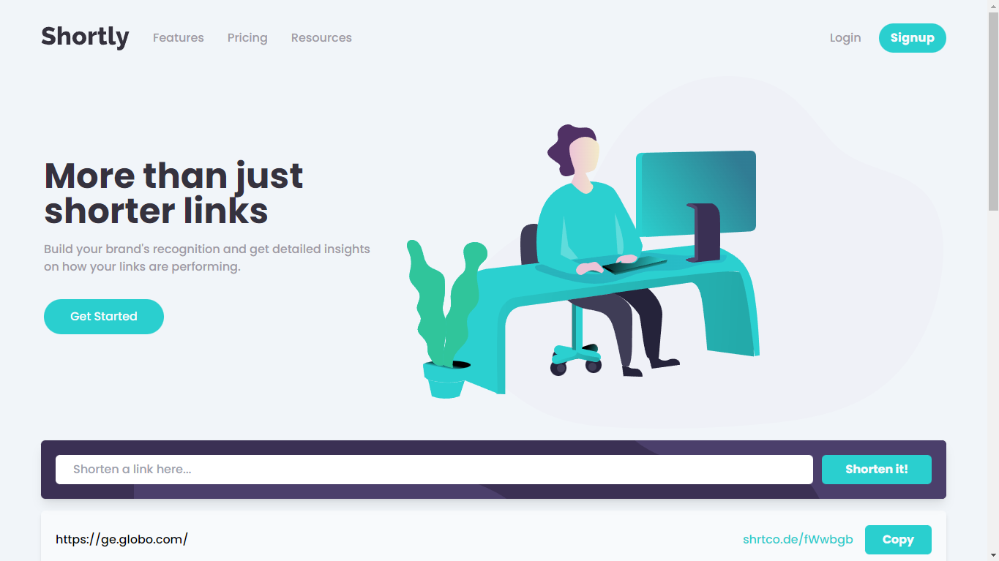

# Frontend Mentor - Shortly URL shortening API Challenge solution

This is a solution to the [Shortly URL shortening API Challenge challenge on Frontend Mentor](https://www.frontendmentor.io/challenges/url-shortening-api-landing-page-2ce3ob-G). Frontend Mentor challenges help you improve your coding skills by building realistic projects.

## Table of contents

- [Overview](#overview)
  - [The challenge](#the-challenge)
  - [Screenshot](#screenshot)
  - [Links](#links)
- [My process](#my-process)
  - [Built with](#built-with)
  - [What I learned](#what-i-learned)
- [Author](#author)

## Overview

### The challenge

Users should be able to:

- View the optimal layout for the site depending on their device's screen size
- Shorten any valid URL
- See a list of their shortened links, even after refreshing the browser
- Copy the shortened link to their clipboard in a single click
- Receive an error message when the `form` is submitted if:
  - The `input` field is empty

### Screenshot

### Links

- Solution URL: [Frontend Mentor](https://your-solution-url.com)
- Live Site URL: [Github pages](https://url-shorter-rm0909.netlify.app//)

## My process

### Built with

- Semantic HTML5 markup
- CSS custom properties
- Flexbox
- CSS Grid
- Mobile-first workflow
- [taildwindCSS](https://tailwindcss.com/) - CSS framework

### What I learned

To follow a layout design and apply it on my project.

I learned to place svg as background, using absolute positioning.

Build this website was very nice. I could pratice my javascript skills.
I'm proud of my entire javascript code since i have been only using react.
Conditional rendering with vanilla javascript is not good.

### Continued development

I don't know if it is ok to have code full of tailwind classes.

## Author

- Website - [Github](https://github.com/rm0909)
- Frontend Mentor - [@rm0909](https://www.frontendmentor.io/profile/rm0909)
